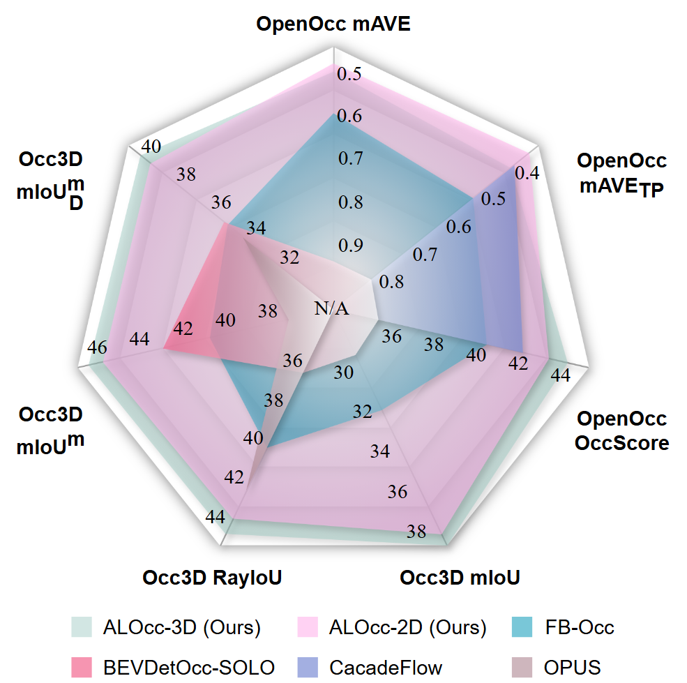
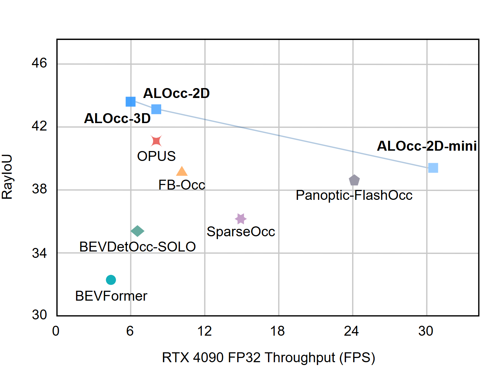

<div id="top" align="center">

<h1 align="center"><b>ALOcc:</b> Adaptive Lifting-based 3D Semantic Occupancy and Cost Volume-based Flow Prediction</h1>

<p align="center">
    <a href="https://arxiv.org/abs/2411.07725" target="_blank"></a>
    <a href="https://opendrivelab.com/challenge2024/" target="_blank"></a>
    <a href="https://opensource.org/licenses/Apache-2.0" target="_blank"></a>
    <a href="https://www.python.org/" target="_blank"></a>
    <a href="https://pytorch.org/" target="_blank"></a>
</p>

**ALOcc** is a state-of-the-art, vision-only framework for dense 3D scene understanding. It transforms multi-camera 2D images into rich, spatiotemporal 3D representations, jointly predicting semantic occupancy grids and per-voxel motion flow. Our purely convolutional design achieves top-tier performance while offering a spectrum of models that balance accuracy and real-time efficiency, making it ideal for autonomous systems.

<p align="center">
  
  
  <br>
</p>
</div>

---


## 🚀 Get Started

### 1. Installation

We recommend managing the environment with Conda.

```bash
# Clone this repository
git clone https://github.com/cdb342/ALOcc.git
cd ALOcc

# Create and activate the conda environment
conda create -n alocc python=3.8 -y
conda activate alocc

# Install PyTorch (example for CUDA 11.8, adjust if needed)
pip install torch==2.0.1+cu118 torchvision==0.15.2+cu118 --extra-index-url https://download.pytorch.org/whl/cu118

# Install MMCV (requires building C++ ops)
# Note: Using the stable 1.x branch for compatibility
git clone https://github.com/open-mmlab/mmcv.git
cd mmcv
git checkout 1.x
MMCV_WITH_OPS=1 pip install -e . -v
cd ..

# Install MMDetection and MMSegmentation
pip install mmdet==2.28.2 mmsegmentation==0.30.0

# Install the ALOcc framework in editable mode
pip install -v -e .

# Install remaining dependencies
pip install torchmetrics timm dcnv4 ninja spconv transformers IPython einops
pip install numpy==1.23.4 # Pin numpy version to avoid potential issues
```

### 2. Data Preparation

#### **nuScenes Dataset**

1.  Download the full nuScenes dataset from the [official website](https://www.nuscenes.org/download).
2.  Download the primary **Occ3D-nuScenes** annotations from the [project page](https://tsinghua-mars-lab.github.io/Occ3D/).
3.  (Optional) For extended experiments, download other community annotations:
    *   [OpenOcc_v2.1 Annotations](https://github.com/OpenDriveLab/OccNet?tab=readme-ov-file#openocc-dataset) & [Ray Mask](https://drive.google.com/file/d/10jB08Z6MLT3JxkmQfxgPVNq5Fu4lHs_h/view)
    *   [SurroundOcc Annotations](https://github.com/weiyithu/SurroundOcc) (unzip and rename folder to `gts_surroundocc`)
    *   [OpenOccupancy-v0.1 Annotations](https://github.com/JeffWang987/OpenOccupancy)

Please organize your data following this directory structure:

```
ALOcc/
├── data/
│   ├── nuscenes/
│   │   ├── maps/
│   │   ├── samples/
│   │   ├── sweeps/
│   │   ├── v1.0-test/
│   │   ├── v1.0-trainval/
│   │   ├── gts/                 # Main Occ3D annotations
│   │   ├── gts_surroundocc/     # (Optional) SurroundOcc annotations
│   │   ├── openocc_v2/          # (Optional) OpenOcc annotations
│   │   ├── openocc_v2_ray_mask/ # (Optional) OpenOcc ray mask
│   │   └── nuScenes-Occupancy-v0.1/ # (Optional) OpenOccupancy annotations
...
```

Finally, run the preprocessing scripts to prepare the data for training:

```bash
# 1. Extract semantic segmentation labels from LiDAR
python tools/nusc_process/extract_sem_point.py

# 2. Create formatted info files for the dataloader
PYTHONPATH=$(pwd):$PYTHONPATH python tools/create_data_bevdet.py
```
Alternatively, you can download the pre-processed [`segmentation labels`](https://huggingface.co/Dobbin/OccStudio/blob/main/lidar_seg.zip), [`train.pkl`](https://huggingface.co/Dobbin/OccStudio/blob/main/bevdetv2-nuscenes_infos_train.pkl) and [`val.pkl`](https://huggingface.co/Dobbin/OccStudio/blob/main/bevdetv2-nuscenes_infos_val.pkl) files from our Hugging Face Hub, and organize their path as:
```
ALOcc/
├── data/
│   ├── lidar_seg
│   ├── nuscenes/
│   │   ├── train.pkl
│   │   ├── val.pkl
│   │   ...
...
```
### 3. Pre-trained Models

For training, please download pre-trained image backbones from [BEVDet](https://github.com/HuangJunJie2017/BEVDet), [GeoMIM](https://github.com/Sense-X/GeoMIM), or our [Hugging Face Hub](https://huggingface.co/Dobbin/OccStudio). Place the checkpoint files in the `ckpts/pretrain/` directory.

---

## 🎮 Train & Evaluate

### Training

Use the provided script for distributed training on multiple GPUs.

```bash
# Syntax: bash tools/dist_train.sh [CONFIG_FILE] [WORK_DIR] [NUM_GPUS]

# Example: Train the ALOcc-3D model with 8 GPUs
bash tools/dist_train.sh configs/alocc/alocc_3d_256x704_bevdet_preatrain.py work_dirs/alocc_3d 8
```

### Testing

Download our official pre-trained models from the [ALOcc Hugging Face Hub](https://huggingface.co/Dobbin/alocc) and place them in the `ckpts/` directory.

```bash
# Evaluate semantic occupancy (mIoU) or occupancy flow
# Syntax: bash tools/dist_test.sh [CONFIG_FILE] [CHECKPOINT_PATH] [NUM_GPUS]

# Example: Evaluate the pre-trained ALOcc-3D model
bash tools/dist_test.sh configs/alocc/alocc_3d_256x704_bevdet_preatrain.py ckpts/alocc_3d.pth 8

# Evaluate semantic occupancy (RayIoU metric)
# Syntax: bash tools/dist_test_ray.sh [CONFIG_FILE] [CHECKPOINT_PATH] [NUM_GPUS]

# Example: Evaluate ALOcc-3D with the RayIoU script
bash tools/dist_test_ray.sh configs/alocc/alocc_3d_256x704_bevdet_preatrain_wo_mask.py ckpts/alocc_3d_wo_mask.pth 8
```

> ⚠️ **Important Note:** When running inference with temporal fusion enabled, please use exactly **1 or 8 GPUs**. Using a different number of GPUs may lead to incorrect results due to a sampler bug causing duplicate sample processing.

### Benchmarking

We provide convenient tools to benchmark model latency (FPS) and computational cost (FLOPs).

```bash
# Benchmark FPS (Frames Per Second)
# Syntax: python tools/analysis_tools/benchmark.py [CONFIG_FILE]
python tools/analysis_tools/benchmark.py configs/alocc/alocc_3d_256x704_bevdet_preatrain.py

# Calculate FLOPs
# Syntax: python tools/analysis_tools/get_flops.py [CONFIG_FILE] --shape [HEIGHT] [WIDTH]
python tools/analysis_tools/get_flops.py configs/alocc/alocc_3d_256x704_bevdet_preatrain.py --shape 256 704
```

---

## 📊 Results & Model Zoo

<details>
<summary><b>🏆 Performance on Occ3D-nuScenes (trained with camera visible mask)</b></summary>

| Model | Backbone | Input Size | mIoU<sub>D</sub><sup>m</sup> | mIoU<sup>m</sup> | FPS | Config | Weights |
|:---|:---:|:---:|:---:|:---:|:---:|:---:|:---:|
| **ALOcc-2D-mini** | R-50 | 256 × 704 | 35.4 | 41.4 | 30.5 | [config](./configs/alocc/alocc_2d_mini_r50_256x704_bevdet_preatrain_16f.py) | [HF Hub](https://huggingface.co/Dobbin/OccStudio/blob/main/alocc_2d_mini_r50_256x704_bevdet_preatrain_16f.pth) |
| **ALOcc-2D** | R-50 | 256 × 704 | 38.7 | 44.8 | 8.2 | [config](./configs/alocc/alocc_2d_r50_256x704_bevdet_preatrain_16f.py) | [HF Hub](https://huggingface.co/Dobbin/OccStudio/blob/main/alocc_2d_r50_256x704_bevdet_preatrain_16f.pth) |
| **ALOcc-3D** | R-50 | 256 × 704 | 39.3 | 45.5 | 6.0 | [config](./configs/alocc/alocc_3d_r50_256x704_bevdet_preatrain_16f.py) | [HF Hub](https://huggingface.co/Dobbin/OccStudio/blob/main/alocc_3d_r50_256x704_bevdet_preatrain_16f.pth) |

</details>

<details>
<summary><b>🏆 Performance on Occ3D-nuScenes (trained w/o camera visible mask)</b></summary>

| Model | Backbone | Input Size | mIoU | RayIoU | RayIoU<sub>1m, 2m, 4m</sub> | FPS | Config | Weights |
|:---|:---:|:---:|:---:|:---:|:---:|:---:|:---:|:---:|
| **ALOcc-2D-mini** | R-50 | 256 × 704 | 33.4 | 39.3 | 32.9, 40.1, 44.8 | 30.5 | [config](./configs/alocc/alocc_2d_mini_r50_256x704_bevdet_preatrain_16f_wo_mask.py) | [HF Hub](https://huggingface.co/Dobbin/OccStudio/blob/main/alocc_2d_mini_r50_256x704_bevdet_preatrain_16f_wo_mask.pth) |
| **ALOcc-2D** | R-50 | 256 × 704 | 37.4 | 43.0 | 37.1, 43.8, 48.2 | 8.2 | [config](./configs/alocc/alocc_2d_r50_256x704_bevdet_preatrain_16f_wo_mask.py) | [HF Hub](https://huggingface.co/Dobbin/OccStudio/blob/main/alocc_2d_r50_256x704_bevdet_preatrain_16f_wo_mask.pth) |
| **ALOcc-3D** | R-50 | 256 × 704 | 38.0 | 43.7 | 37.8, 44.7, 48.8 | 6.0 | [config](./configs/alocc/alocc_3d_r50_256x704_bevdet_preatrain_16f_wo_mask.py) | [HF Hub](https://huggingface.co/Dobbin/OccStudio/blob/main/alocc_3d_r50_256x704_bevdet_preatrain_16f_wo_mask.pth) |
</details>

<details>
<summary><b>🏆 Performance on OpenOcc (Semantic Occupancy and Flow)</b></summary>

| Method | Backbone | Input Size | Occ Score | mAVE | mAVE<sub>TP</sub> | RayIoU | RayIoU<sub>1m, 2m, 4m</sub> | FPS | Config | Weights |
|:---|:---:|:---:|:---:|:---:|:---:|:---:|:---:|:---:|:---:|:---:|
| **ALOcc-Flow-2D** | R-50 | 256 × 704 | 41.9 | 0.530 | 0.431 | 40.3 | 34.3, 41.0, 45.5 | 7.0 | [config](https://huggingface.co/Dobbin/OccStudio/blob/main/alocc_flow_2d_r50_256x704.py) | [HF Hub](https://huggingface.co/Dobbin/OccStudio/blob/main/alocc_flow_2d_r50_256x704.pth) |
| **ALOcc-Flow-3D** | R-50 | 256 × 704 | 43.1 | 0.549 | 0.458 | 41.9 | 35.6, 42.9, 47.2 | 5.5 | [config](https://huggingface.co/Dobbin/OccStudio/blob/main/alocc_flow_3d_r50_256x704.py) | [HF Hub](https://huggingface.co/Dobbin/OccStudio/blob/main/alocc_flow_3d_r50_256x704.pth) |
</details>

*For more detailed results and ablations, please refer to our [paper](https://arxiv.org/abs/2411.07725).*

---

## 🙏 Acknowledgement

This project is built upon the excellent foundation of several open-source projects. We extend our sincere gratitude to their authors and contributors.

-   [open-mmlab](https://github.com/open-mmlab)
-   [BEVDet](https://github.com/HuangJunJie2017/BEVDet)
-   [FB-Occ](https://github.com/NVlabs/FB-BEV)
-   [FlashOcc](https://github.com/Yzichen/FlashOCC)
-   [Occ3D](https://github.com/Tsinghua-MARS-Lab/Occ3D)

---

## 📜 Citation

If you find ALOcc useful for your research or applications, please consider citing our paper:

```bibtex
@InProceedings{chen2025alocc,
    author    = {Chen, Dubing and Fang, Jin and Han, Wencheng and Cheng, Xinjing and Yin, Junbo and Xu, Chenzhong and Khan, Fahad Shahbaz and Shen, Jianbing},
    title     = {Alocc: adaptive lifting-based 3d semantic occupancy and cost volume-based flow prediction},
    booktitle = {Proceedings of the IEEE/CVF International Conference on Computer Vision (ICCV)},
    month     = {October},
    year      = {2025},
}

@article{chen2024adaocc,
  title={AdaOcc: Adaptive Forward View Transformation and Flow Modeling for 3D Occupancy and Flow Prediction},
  author={Chen, Dubing and Han, Wencheng and Fang, Jin and Shen, Jianbing},
  journal={arXiv preprint arXiv:2407.01436},
  year={2024}
}
```

<p align="right"><a href="#top">🔼 Back to Top</a></p>
